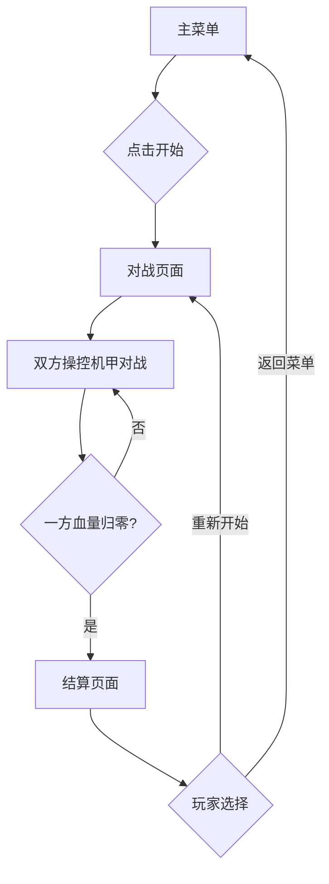

## 1. 产品概述

一款复古像素风格的机甲对战小游戏，支持两名玩家在同一台设备上进行本地对战。玩家可以操控各自的机甲角色进行移动、攻击、防御和释放技能，通过血量消耗和胜负判定完成对战回合。

- 目标用户：休闲游戏玩家、像素风格爱好者、本地多人游戏玩家
- 核心价值：简单上手、快节奏对战的像素风机甲格斗体验

## 2. 核心功能

### 2.1 用户角色

| 角色 | 说明 |
|------|------|
| 玩家1 | 使用键盘左侧按键操控机甲1 |
| 玩家2 | 使用键盘右侧按键操控机甲2 |

### 2.2 功能模块

1. **主菜单页面**：游戏标题、开始按钮、操作说明
2. **对战页面**：双人对战核心界面，包含血量条、计时器、游戏画面
3. **结算页面**：胜负结果展示、重新开始按钮

### 2.3 页面详情

| 页面名称 | 模块名称 | 功能描述 |
|----------|----------|----------|
| 主菜单 | 标题展示 | 像素风格游戏标题，带呼吸闪烁动画 |
| 主菜单 | 开始按钮 | 点击开始对战，进入对战页面 |
| 主菜单 | 操作说明 | 展示两名玩家的按键操作说明 |
| 对战页面 | 游戏画布 | Canvas渲染的像素风格对战场景 |
| 对战页面 | HUD信息栏 | 双方血量条、角色名称、计时器 |
| 对战页面 | 暂停按钮 | 暂停/继续游戏 |
| 结算页面 | 胜负展示 | 显示获胜方、战斗统计 |
| 结算页面 | 操作按钮 | 重新开始、返回菜单 |

## 3. 核心流程

## 4. 用户界面设计

### 4.1 设计风格

- **主题**：复古像素风，深色工业背景，霓虹色调点缀
- **主色调**：深灰背景(#1a1a2e)、霓虹蓝(#0ff)、霓虹红(#f0f)、橙黄(#f90)
- **按钮风格**：像素边框按钮，悬停时发光效果
- **字体**：像素风格字体（Press Start 2P），中文使用像素化等宽字体
- **布局**：居中布局，对战画面全屏画布，HUD叠加在画布上方
- **动画**：像素角色帧动画、血量条像素化递减、粒子爆炸效果

### 4.2 页面设计概览

| 页面名称 | 模块名称 | UI元素 |
|----------|----------|--------|
| 主菜单 | 标题 | 大字像素标题，霓虹蓝渐变，呼吸发光动画，居中 |
| 主菜单 | 开始按钮 | 像素边框，霓虹绿填充，hover发光，居中 |
| 主菜单 | 操作说明 | 半透明暗色面板，左右分栏展示P1/P2按键 |
| 对战页面 | 游戏画布 | 全屏Canvas，像素地面、城市天际线背景 |
| 对战页面 | HUD | 顶部血条栏，像素化进度条，双方头像/名称 |
| 结算页面 | 结果面板 | 中央弹出面板，像素边框，胜利动画，统计信息 |

### 4.3 响应式设计

- 桌面优先，支持1280x720及以上分辨率
- 游戏画布固定16:9比例，自适应缩放
- 移动端支持触摸操作提示

## 5. 游戏玩法设计

### 5.1 操作方式

**玩家1（机甲A - 蓝色）**：
- A/D：左右移动
- W：跳跃
- F：普通攻击（拳击）
- G：特殊攻击（能量炮，消耗能量）
- E：防御（格挡）

**玩家2（机甲B - 红色）**：
- ←/→：左右移动
- ↑：跳跃
- K：普通攻击（拳击）
- L：特殊攻击（能量炮，消耗能量）
- O：防御（格挡）

### 5.2 战斗机制

- 每台机甲100点血量，受击时减少
- 普通攻击：8-12点伤害，无消耗
- 特殊攻击：15-20点伤害，消耗20点能量，带击退效果
- 防御状态：减免70%伤害
- 能量系统：初始100点，自然恢复每秒2点，最大100点
- 胜负判定：一方血量归零即判负，另一方获胜