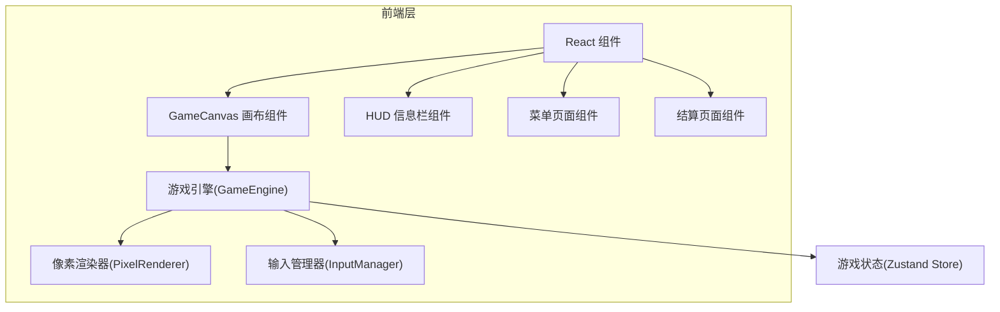

## 1. 架构设计



## 2. 技术选型

- 前端：React@18 + TypeScript + Vite
- 样式：Tailwind CSS + 自定义CSS动画
- 状态管理：Zustand
- 游戏渲染：HTML5 Canvas 2D API
- 字体：Press Start 2P (Google Fonts)
- 后端：无（纯前端游戏）

## 3. 路由定义

| 路由 | 页面 | 说明 |
|------|------|------|
| / | 主菜单 | 游戏标题和开始入口 |
| /game | 对战页面 | 核心对战界面 |
| /gameover | 结算页面 | 胜负结果展示 |

## 4. 核心代码结构

```
src/
├── components/
│   ├── GameCanvas.tsx        # Canvas游戏画布
│   ├── HUD.tsx               # 血量条和信息展示
│   ├── MainMenu.tsx          # 主菜单页面
│   ├── GameOver.tsx          # 结算页面
│   └── PixelButton.tsx       # 像素风格按钮组件
├── engine/
│   ├── GameEngine.ts         # 游戏主循环与状态管理
│   ├── Player.ts             # 玩家/机甲实体类
│   ├── InputManager.ts       # 键盘输入管理
│   ├── PixelRenderer.ts      # 像素风格渲染器
│   ├── Physics.ts            # 碰撞检测与物理
│   └── types.ts              # 类型定义
├── store/
│   └── gameStore.ts          # Zustand全局状态
├── pages/
│   ├── MenuPage.tsx          # 菜单页面
│   ├── GamePage.tsx          # 对战页面
│   └── GameOverPage.tsx      # 结算页面
├── App.tsx
├── main.tsx
└── index.css
```

## 5. 数据模型

### 5.1 游戏状态类型

```typescript
interface GameState {
  phase: 'menu' | 'playing' | 'paused' | 'gameover';
  player1: PlayerState;
  player2: PlayerState;
  winner: 1 | 2 | null;
  timer: number;
}

interface PlayerState {
  name: string;
  hp: number;        // 0-100
  maxHp: number;     // 100
  energy: number;    // 0-100
  x: number;
  y: number;
  vx: number;
  vy: number;
  isGrounded: boolean;
  isBlocking: boolean;
  facingRight: boolean;
  state: 'idle' | 'walking' | 'jumping' | 'attacking' | 'blocking' | 'special' | 'hurt';
  attackCooldown: number;
  specialCooldown: number;
  animFrame: number;
}
```

### 5.2 攻击数据

| 攻击类型 | 伤害 | 能量消耗 | 冷却时间 | 击退距离 |
|----------|------|----------|----------|----------|
| 普通攻击 | 8-12 | 0 | 500ms | 30px |
| 特殊攻击 | 15-20 | 20 | 1500ms | 80px |

## 6. 素材方案

所有素材通过Canvas像素绘制生成，无需外部图片资源：

- **背景**：深色渐变天空 + 像素化城市天际线剪影 + 地面网格线
- **机甲A（蓝色）**：32x32像素点阵绘制，含idle/walk/jump/attack/block/hurt帧
- **机甲B（红色）**：32x32像素点阵绘制，镜像配色，相同帧动画
- **特效**：粒子像素爆炸、能量光波、格挡护盾闪光
- **HUD**：像素化血条和能量条